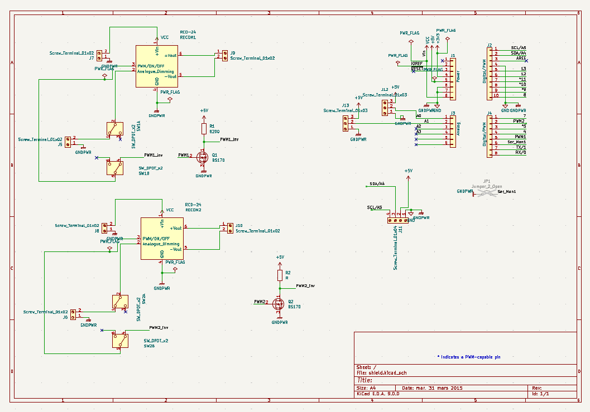
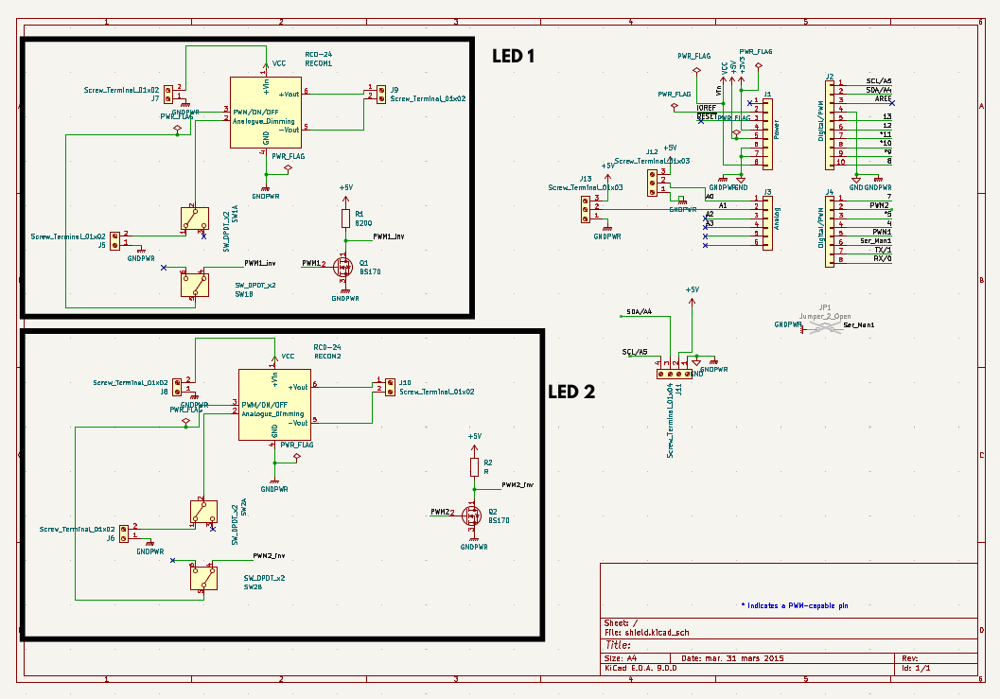
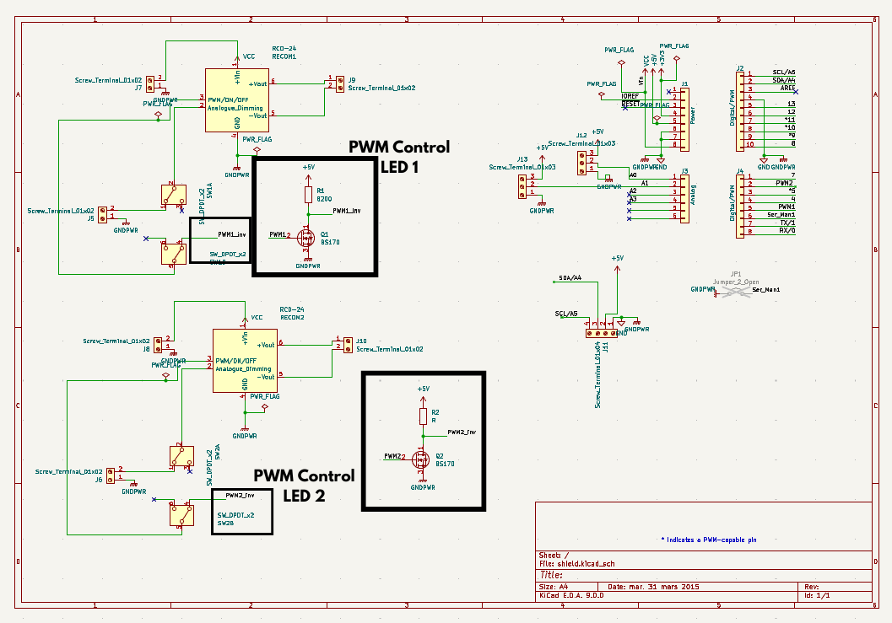
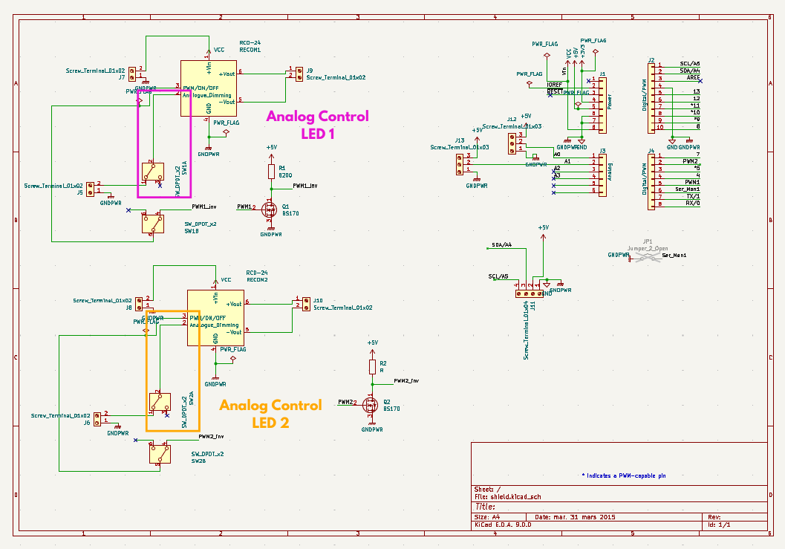
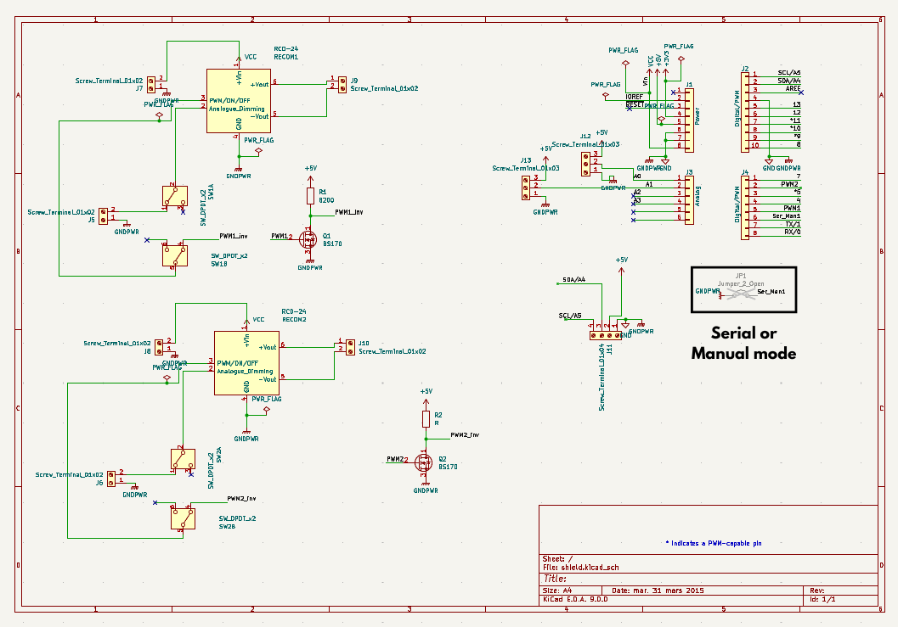

# CSL-light-hardware

## I. Objectives 

## II. Usage
Branchement 
Utilisation du code Python

## III. Manufacture

### a. Kicad

Complete Circuit on Kicad : 

LED 1 and 2 : 

PWM Control : 

Analog Control : 

Serial or Manual Mode : 

Explication des différents rôles : 

Transistor : inverse le signal / RECOM

### b. Welding

- Shield de Arduino
- On soude pas sur le pcb
- Vissable sur un casing 3D
- Prises jack

Liste des composants : 

- RECOM qui se rapproche le plus pour l'instant :
https://www.gotronic.fr/art-convertisseur-r-78e3-3-0-5-29589.htm
Code : 14977
Prix : 4,6€
REF Gotronic, lien et prix

### c. Assembly
### d. Code

## IV. Pref

Specs avec Mathis
