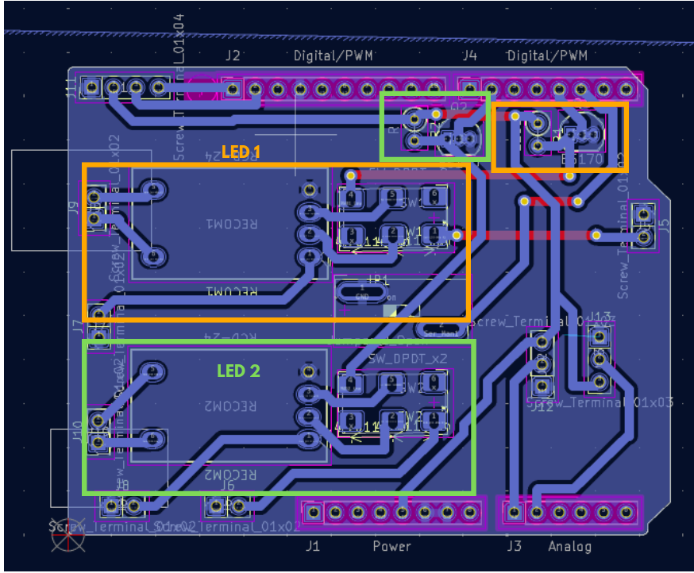
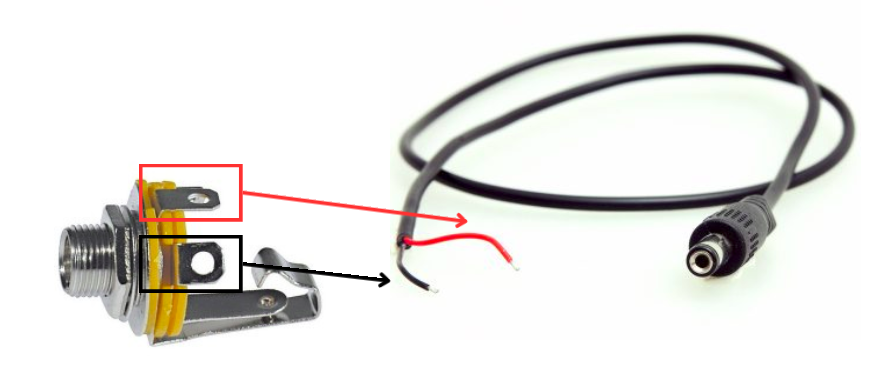

# CSL-light-hardware

## I. Objectives 
### LED module operating modes with a pcb plate

#### MODE 1 - Sequence of pulses
The user can define on the computer the frequency and amplitude of a sequence of pulses.

#### MODE 2 - Analog control 
The user can send an analog signal to control the LED. The analog sugnal can be designed using eg. a signal generator. 

#### MODE 3 - Manual control
The user can set the LED level using a potentiometer.

## II. Usage

### I. Access mode 
- **To access Mode 1**: set interruptor to 1 ("serial" shows up on the screen) and switch the flip to PWM.
- **To access Mode 2**: set interruptor to 1 ("serial" shows up on the screen) and switch the flip to analog.
- **To access Mode 3**: set interruptor to 0 ("manual" shows up on the screen).

### II. Connection 
- Insert the LED jacks into the corresponding holes
- Insert the generator jacks into the corresponding holes
- Insert the jacks to feed the analog signals into the corresponding input holes

### III. Using the LEDControl_interrupt_screen_ascii code

First, open the LEDControl_interrupt_screen_ascii.cpp code in Arduino.ide.
To run the program, you must first have the SSD1306Ascii library installed on Arduino.

## III. Manufacture

### I. Kicad

#### A. Complete electronic circuit

Complete Circuit on Kicad : 

LED 1 and 2 : 

PWM Control : 

Analog Control : 

Serial or Manual Mode : 

#### B. Component roles
- **Top connectors (J5, J7, J6, J8, J10)** :
  These are screw terminal blocks used to connect LEDs, power, or other peripherals.
- **Relays (RECOM1, RECOM2, etc.)** :
Their role is to adjust the LED light output to prevent damage. They therefore act as power regulators.
- **MOSFETs (BS170)** :
These are used to invert the signal. In fact, the RECOM inverts the input signal, it is inverted a first time before it processes it, in order to obtain the initially desired signal at the output. This can be useful if the LEDs require active low control (they light up when the signal is LOW).
- **Potentiometers (RV1, RV2)** :
These allow for a manual mode to adjust LED intensity via an analog input.
- **Double Switch (SW_DPDT_x2)** :
Two switches are used to select between analog or PWM control for each LED.
- **A Switch On-Off (Jumper_2_Open)** :
It allows switching between Serial and Manual modes.

#### C. Impression

It lasts about 30 minutes.

### II. Welding

#### A. Shield Arduino
First, you need to solder the branches of the Arduino.

#### B. Components that you solder directly onto the PCB board
- Resistors
- MOSFET transistors
- RECOM
- Terminal blocks
- Vias

#### C. Components that you don't solder directly onto the PCB board
- The 2 potentiometers
- The OLED screen
- The 2 switches
- The on-off switch

#### D. Jack sockets
You have to solder cables with the female jack sockets.

For the black and red cables of the male jack, you must solder them to the generator, LED, and signal cables.
Before soldering, prepare some heat-shrink tubing to prevent loose connections.

#### E. List of components

- RECOM qui se rapproche le plus pour l'instant :
https://www.gotronic.fr/art-convertisseur-r-78e3-3-0-5-29589.htm
Code : 14977
Prix : 4,6€
REF Gotronic, lien et prix

- Interrupteur qui se rapproche le plus pour l'instant :
https://www.gotronic.fr/art-interrupteur-h8650-4226.htm
Code : 07071
Prix : 3,9€

- Ecran OLED :
https://www.gotronic.fr/art-module-afficheur-oled-0-96-tf052-28511.htm
Code : 36038
Prix : 9,5€

- Potentiomètre :
https://www.gotronic.fr/art-potentiometre-logarithmique-10k-937-3000.htm
Code : 04519
Prix : 2,60€

### III. Assembly

#### A. Box printing

Printing the box takes approximately 1 hour and 20 minutes.
Printing the box lid takes approximately 30 minutes.
Printing the small panel with the instructions takes approximately 13 minutes.

#### B. Plastic inserts

You will need to make three 3.7mm diameter, 3mm deep plastic inserts with 6mm long M3 screws to secure the Arduino to the enclosure lid. 
Then, make 3mm diameter, 3mm deep plastic inserts with 8mm long M3 screws to close the enclosure.

#### C. Finalization

Screw the components into the box in this order:
- Female jack sockets
- OLED display with 10mm long M2 screws and nuts
- The two switches
- The on-off switch
- The two potentiometers

### IV. Code

## IV. Pref

Specs avec Mathis
