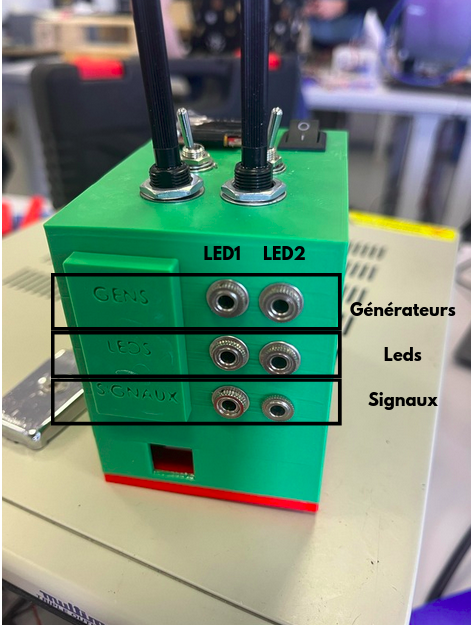

# CSL-light-hardware

## I. Objectives 
### LED module operating modes with a pcb plate
The LED module offers three operating modes, based on the PWM and analog outputs of a microcontroller like the Arduino : 

- Serial Mode -> Control via a computer via serial communication (USB or Bluetooth).
- Manual Mode -> Manual control with potentiometers.
- Analog/PWM Selection -> Allows you to choose the type of modulation applied to the LEDs.

A master switch allows you to switch between Serial and Manual mode.

#### I. Serial Mode (via computer)

This mode allows you to control LED brightness from a computer using serial communication via the Arduino's USB port.
It has two sub-modes:

##### A. PWM (Pulse Width Modulation) Sub-Mode

Light intensity is controlled using an Arduino PWM output.
The user sends a value from 0 to 255 via the serial port.
The Arduino adjusts the LED intensity based on the duty cycle.
The BS170 MOSFET inverts the signal before it reaches the LEDs.

##### B. Analog Sub-Mode

The user sends a target voltage (e.g., 3.3V) via the serial port.
LED brightness is adjusted by sending an analog value (voltage) via the serial port.
RECOM relays regulate the light output to avoid damaging the LEDs.

#### II. Manual mode (with a potentiometer)

In this mode, the light intensity is adjusted manually with a potentiometer.

##### A. Analog Sub-Mode
The Arduino reads the potentiometer's output voltage (0V to 5V) from an analog input (A0, A1, etc.), which continuously controls the LED power supply.

##### B. PWM Sub-Mode
Nothing happens.

## II. Usage

### I. Connection 
- Insert the LED jacks into the corresponding holes
- Insert the generator jacks into the corresponding holes
- Insert the jacks for viewing the signals into the corresponding holes

### II. Using the LEDControl_interrupt_screen_ascii code

## III. Manufacture

### I. Kicad

Complete Circuit on Kicad : 

LED 1 and 2 : 

PWM Control : 

Analog Control : 

Serial or Manual Mode : 

Explication des différents rôles : 

Transistor : inverse le signal / RECOM

### II. Welding

- Shield de Arduino
- On soude pas sur le pcb
- Vissable sur un casing 3D
- Prises jack

Liste des composants : 

- RECOM qui se rapproche le plus pour l'instant :
https://www.gotronic.fr/art-convertisseur-r-78e3-3-0-5-29589.htm
Code : 14977
Prix : 4,6€
REF Gotronic, lien et prix

- Interrupteur qui se rapproche le plus pour l'instant :
https://www.gotronic.fr/art-interrupteur-h8650-4226.htm
Code : 07071
Prix : 3,9€

- Ecran OLED :
https://www.gotronic.fr/art-module-afficheur-oled-0-96-tf052-28511.htm
Code : 36038
Prix : 9,5€

- Potentiomètre :
https://www.gotronic.fr/art-potentiometre-logarithmique-10k-937-3000.htm
Code : 04519
Prix : 2,60€

### III. Assembly
### IV. Code

## IV. Pref

Specs avec Mathis
